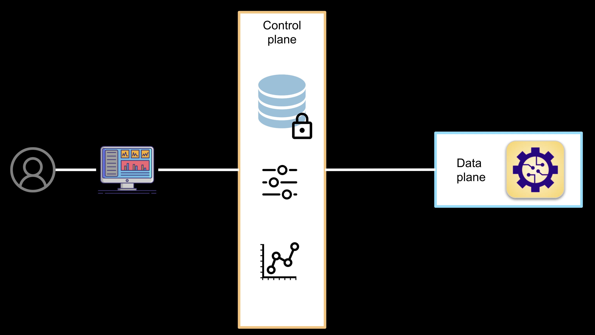
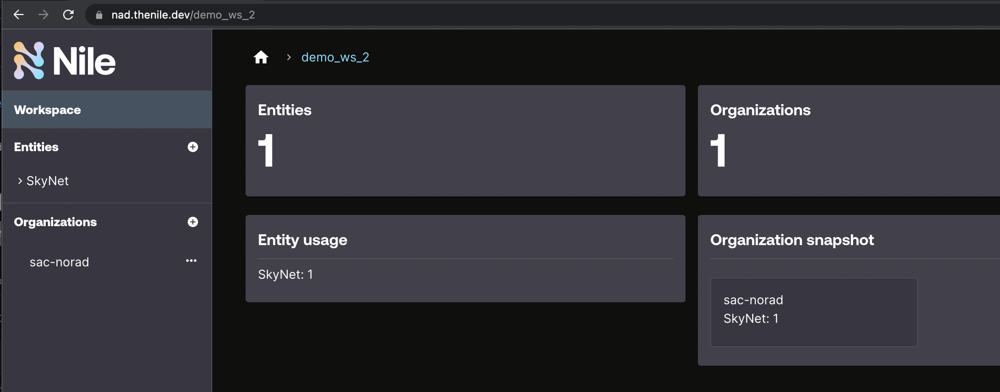
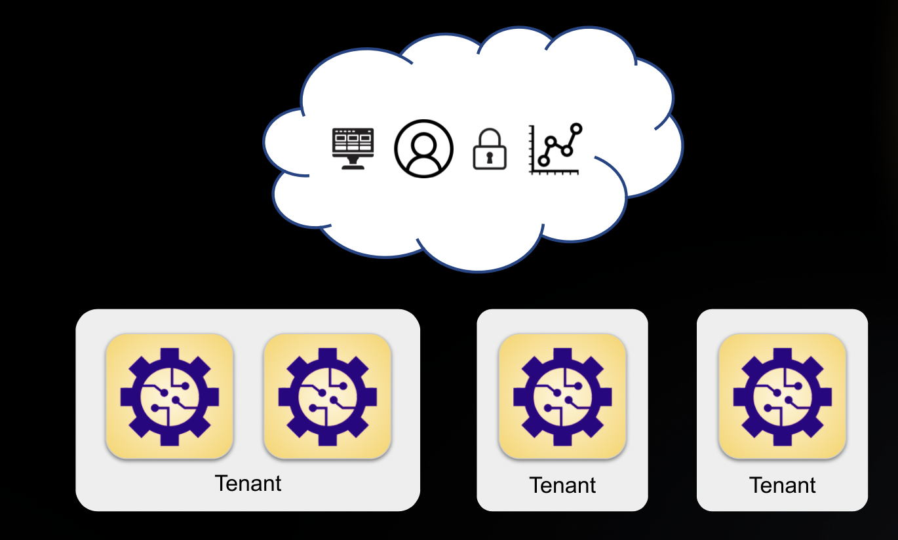
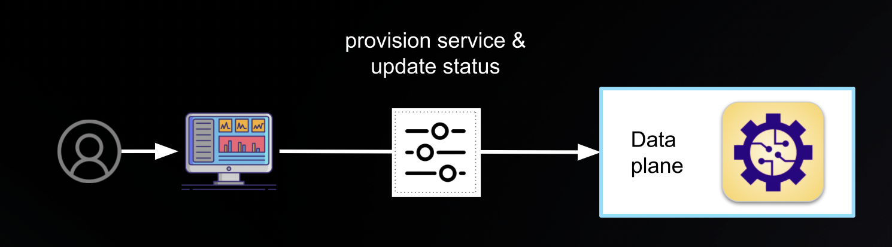
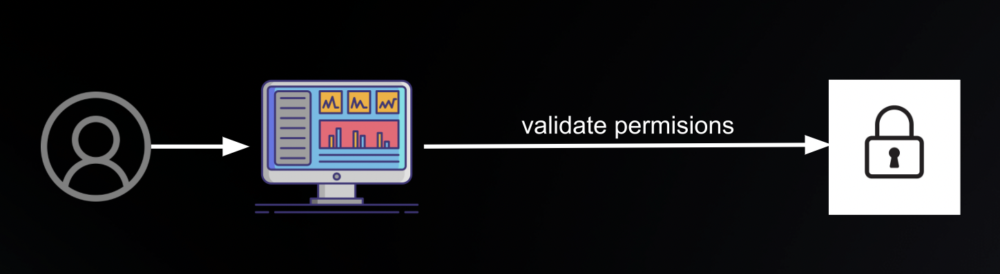
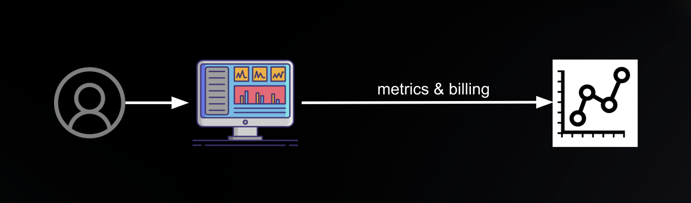
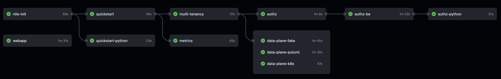

### Table of Contents

* [What is Nile](#what-is-nile)
* [Getting started](#getting-started)
* [Examples by Feature](#examples-by-feature)
* [Examples by Language](#examples-by-language)
* [Advanced](#advanced)
* [Community](#community)

## What is Nile

Developing a SaaS product can have a lot of complexity in lifecycle management and codifying best practices.
These SaaS architectures have to address really hard problems, including:

- [Multi-tenant control plane](#multi-tenancy)
- Event handling, e.g. [reconciling the data plane](#data-plane) with the control plane for infrastructure SaaS
- [Metrics and consumption-based billing](#metrics)
- [Control plane access control](#authorization)
- Consistent user experience for [webapp UIs](#webapp) and APIs

Nile provides a tenant-aware, serverless database that is used to build SaaS control planes and solves a lot of these problems out of the box.
Think about all the problems above, and how they all lie just under the surface of a SaaS webapp front-end.
Check out https://demo-db-saas.thenile.dev (login as one of the predefined [users](../usecases/DB/init/users.json)), whish is a mocked example of a SaaS that we built on top of Nile to demonstrate the ease with which you can deliver a SaaS infrastructure service (see [webapp](#webapp) for the source code).



This collection of examples demonstrates how to use Nile in a variety of ways.
The examples can also be run sequentially to build on top of one another, in which case, we recommend running them in the order presented here to build up your SaaS as you go.
Or jump to the [webapp](#webapp) to run an end-to-end example for multi-tenancy, event handling, a metrics API, and a front-end for self-service provisioning.

## Getting started

To get started:

1. [Setup your Nile workspace and environment](#setup)
2. [Run the Quickstart](#quickstart) to configure a minimal control plane in Nile.

You can then follow on with any of the other examples for different use cases.

### Setup

#### Nile workspace and developer credentials

- ✅ Log into Nile Admin Dashboard

   Navigate your web browser of choice to the [Nile Admin Dashboard](https://nad.thenile.dev/) and click `Continue with Google` to login via SSO. (Don't want SSO? Go to the [Nile website](https://thenile.dev), enter your email address, and click `Talk to us`, then someone from Nile will contact you to setup up an email and password for you)

- ✅ Create a Nile workspace

  If you don't already have a Nile workspace, create it now. From the dashboard, click `Create a workspace`, and in the textbox enter the name of a new workspace. This represents your control plane where your SaaS application lives.

- ✅ Get your workspace access token

  From the dashboard, get your [workspace access token](https://www.thenile.dev/docs/current/quick-start-ui#more-examples).  This token enables you to programmatically run the examples in this repo.

#### Your local environment

- ✅ Clone the GitHub repository

  From a terminal window, clone the [theniledev/examples](https://github.com/theniledev/examples) repo and change into the new directory.

  ```bash
  git clone git@github.com:TheNileDev/examples.git
  cd examples
  ```

- ✅ Create a local `.env` file

  To run any example, you need a local `.env` file with your Nile configuration.
  At the top-level of the examples, copy the [.env.defaults](.env.defaults) file to a new file `.env`, and then edit the values in the `.env` file to match what you created in the dashboard. In particular, set the values of your Nile workspace and credentials to match what you have in the Nile Admin Dashboard.

  ```bash
  cp .env.defaults .env     # edit file (set NILE_WORKSPACE, and {NILE_WORKSPACE_ACCESS_TOKEN} or {NILE_DEVELOPER_EMAIL and NILE_DEVELOPER_PASSWORD})
  ```

- ✅ Verify Node version (Javascript examples only)

  For the Javascript examples, validate your environment has the minimum required Node version v18.0.0 or higher. If you are running earlier versions, you may encounter errors such as `ReferenceError: fetch is not defined`. (If you use `nvm`, run `nvm use`).
   
### Quickstart

Start with the quickstart to configure a base Nile control plane.
This provides a simple setup to learn the concepts but also serves as the foundation for the other examples below.

- [Quickstart with JS](quickstart) | JS SDK | Setup a minimal Nile control plane with a single tenant
- [Quickstart with Python](quickstart-python) | Python SDK | Setup a minimal Nile control plane with a single tenant



## Examples by Feature

### Multi-tenancy

Tenants have access to specific organizations that have isolated sets of resources.
Users are allowed to access only the entity instances in the organizations to which they have been added.

- [Multi-tenancy](multi-tenancy/) | JS SDK | Setup the Nile control plane with multiple tenants and users



### Data Plane

These examples show how to synchronize, e.g. reconcile, your data plane and control plane in real time with Nile events.
As instances are created or destroyed from the control plane, the example reconciler creates or destroys data plane deployments.
Even if you're using another deployment tool like Kubernetes or Terraform, similar principles apply as they do for Pulumi.

- [Data Plane with Pulumi via JS](data-plane/pulumi/) | JS SDK | Synchronize your data plane and control plane
- [Data Plane with Apache Flink and Kubernetes via JS](data-plane/k8s/) | JS SDK | Synchronize a control plane built with Nile with data plane that uses Apache Flink and Kubernetes
- [Data Plane with Apache Flink and Kubernetes via Python](data-plane-python/k8s/) | Python SDK | Synchronize a control plane built with Nile with data plane that uses Apache Flink and Kubernetes
- [Fake Data Plane via JS](data-plane/fake/) | JS SDK | Synchronize your fake data plane and control plane (if you don't have a real data plane to test)



### Authorization

Attribute-based access control (ABAC) is an authorization model that gives you fine-grained authorization capabilities.
You can configure these in the control plane so that they are aligned to your business's security policies.

- [Authorization with JS](authz/) | JS SDK | Use ABAC to grant and revoke permissions to resources
- [Authorization with Python](authz-python/) | Python SDK | Use ABAC to grant and revoke permissions to resources
- [Authorization App Backend with JS](authz-be/) | JS SDK | Authorize users against Nile control plane for your backend applications



### Metrics

Nile provides a metrics API and matching UI components.
This allows you to add real-time data features to your application, for example, each end user of your SaaS can see their real-time resource consumption and the cost incurred to date.
Read more on the importance of metrics and consumption-based billing in the blog post [Launching an Infrastructure SaaS Product, An Example Walkthrough](https://www.thenile.dev/blog/launch-infra-saas#metrics-and-consumption-based-billing).

- [Metrics with JS](metrics/) | JS SDK | Produce and get mock metrics



### Webapp

Launch a front-end web application that is customizable on a per-tenant basis.
The webapp includes Nile React components for metrics.

- [Webapp](webapp/) | JS SDK | Builds a self-service frontend that integrates with Nile on the backend


### Other

Here are additional examples that you can refer to.

- [Python + Flask Todo List Webapp](python-flask-todo-list/) | Python REST | Take a basic Todo List webapp written in Python and Flask and turn it to a PLG SaaS product with Nile APIs

## Examples by Language

> Note: the languages and examples shown are an indication just of which examples have been developed, not of what's available.
> Please see the Nile API and SDK documentation for details.

###  Javascript

These examples use the [nile-js](https://github.com/TheNileDev/nile-js) SDK.

- [Quickstart with JS](quickstart) | JS SDK | Setup a minimal Nile control plane with a single tenant
- [Multi-tenancy](multi-tenancy/) | JS SDK | Setup the Nile control plane with multiple tenants and users
- [Data Plane with Pulumi via JS](data-plane/pulumi/) | JS SDK | Synchronize your data plane and control plane
- [Data Plane with Apache Flink and Kubernetes via JS](data-plane/k8s/) | JS SDK | Synchronize a control plane built with Nile with data plane that uses Apache Flink and Kubernetes
- [Authorization with JS](authz/) | JS SDK | Use ABAC to grant and revoke permissions to resources
- [Authorization App Backend with JS](authz-be/) | JS SDK | Authorize users against Nile control plane for your backend applications
- [Webapp](webapp/) | JS SDK | Builds a self-service frontend that integrates with Nile on the backend

###  Python

These examples use the [nile-py](https://github.com/TheNileDev/nile-py) SDK.

- [Quickstart with Python](quickstart-python) | Python SDK | Setup a minimal Nile control plane with a single tenant
- [Data Plane with Apache Flink and Kubernetes via Python](data-plane-python/k8s/) | Python SDK | Synchronize a control plane built with Nile with data plane that uses Apache Flink and Kubernetes
- [Authorization with Python](authz-python/) | Python SDK | Use ABAC to grant and revoke permissions to resources
- [Python + Flask Todo List Webapp](python-flask-todo-list/) | Python REST | Take a basic Todo List webapp written in Python and Flask and turn it to a PLG SaaS product with Nile APIs

## Advanced

### Change Entity Type

The default scenario in these examples is a company that provides a database as SaaS. 
But you can modify the `NILE_ENTITY_NAME` parameter in your `.env` file (see [Setup](#setup)) to change it to be any other type of service offering, one of:

- [Database as a Service](usecases/DB/) (same as in the Nile Quickstart): `NILE_ENTITY_NAME=DB`
- [SkyNet as a Service](usecases/SkyNet/): `NILE_ENTITY_NAME=SkyNet`
- [Banking as a Service](usecases/Banking/): `NILE_ENTITY_NAME=Banking`
- [Workload as a Service](usecases/Workload/): `NILE_ENTITY_NAME=Workload`
- [YOLO](usecases/README.md#yolo)

### Run in Gitpod (Experimental)

Try out the examples in [Gitpod](https://gitpod.io/#https://github.com/theniledev/examples/tree/main).

Known limitation: webapp won't work

### Testing

The examples are validated via GitHub Actions, a flexible CI/CD tool that executes the examples against Nile.
For more details, view this repo's [workflow](.github/workflows/validate-examples.yml).



## Community

1. Join the [Slack community for SaaS developers](https://saas-community.github.io), who are learning from each other to build spectacular services in the cloud.  

2. Subscribe to the [SaaS Developer Community Youtube channel](https://www.youtube.com/channel/UCZuLNqvV4oUMVyNq70mFF0g) to learn from experts in the field.

3. Learn more about the SaaS space from the [Nile blog](https://www.thenile.dev/blog)

4. If you have any questions, go to the [Nile website](https://thenile.dev) and reach out to us!
