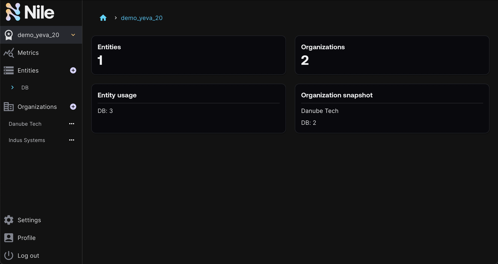

# Nile Data Plane Example #


## Contents

* [Overview](#overview)
* [Prerequisites](#prerequisites)
* [Setup](#setup)
* [Configure the Control Plane](#configure-the-control-plane)
* [Run the reconciler](#run-the-reconciler)
* [Explanation](#explanation)
* [Add or remove instances](#add-or-remove-instances)
* [Next steps](#next-steps)

## Overview

As described in the [top-level README](../../README.md), the mock scenario in these examples is a company that provides SaaS.

Consider an end user who logs into the SaaS and wants to provision a new instance of the service offering:


This example demonstrates how to synchronize (i.e., `reconcile`) the data
plane and control plane in real time with Nile events.
It operates on all the organizations within a Nile workspace, first synchronizing
the current state and then listening for new events.


Nile doesn't prescribe any particular data plane deployment solution, but here we'll
use a fake data plane.  The reconciler pretends to talk to a data plane, but all it does is
update instance properties with an `Up` status and random endpoint value.

If you're using a real data plane, consider running other examples (or connect to your own by replacing the appropriate classes in these examples):

- [Data Plane with Pulumi via JS](../../data-plane/pulumi/) | JS SDK | Synchronize your data plane and control plane
- [Data Plane with Apache Flink and Kubernetes via JS](../../data-plane/k8s/) | JS SDK | Synchronize a control plane built with Nile with data plane that uses Apache Flink and Kubernetes
- [Data Plane with Apache Flink and Kubernetes via Python](../../data-plane-python/k8s/) | Python SDK | Synchronize a control plane built with Nile with data plane that uses Apache Flink and Kubernetes

## Prerequisites ##

This example assumes you have:

* A Nile developer account
* Validate your environment has the minimum required Node version v18.0.0 or higher. If you are running earlier versions, you may encounter errors such as `ReferenceError: fetch is not defined`. (If you use `nvm`, run `nvm use`).

## Setup

You must do all the steps in the [Setup section](../../README.md#setup) of the top-level README.md.

:stop_sign: **STOP** :stop_sign: Do not proceed until you have done the above setup :heavy_exclamation_mark:

## Configure the Control Plane ##

There are a few ways to configure the control plane:

- [Nile Admin Dashboard](#nile-admin-dashboard): use the UI to manually configure the control plane
- [Programmatically](#programmatically): use the provided script which leverages the Nile SDK

### Nile Admin Dashboard

> If you're not familiar with the terminology used below, read the
> [Nile Quickstart](https://www.thenile.dev/docs/current/quick-start-ui).

For the values below, make sure they match what you set in the `.env` file.

1. Login to the [Nile Admin Dashboard](https://nad.thenile.dev/).
2. Create a workspace, which must be globally unique
3. Create an entity type called `DB` from [this definition](../quickstart/src/models/SaaSDB_Entity_Definition.json), which is also available as a template from the Nile Admin Dashboard.
4. Create an organization in the workspace named "Danube Tech".
5. Create an entity instance of type "DB" in the organization, with a value that matches the schema defined earlier:

```json
{
  "dbName": "myDB-products",
  "cloud": "gcp",
  "environment": "prod",
  "size": 100,
}
```

### Programmatically

1. Install and build the project

```bash
yarn install && yarn build
```

2. Configure the control plane. This command will read from the `.env` file you defined earlier. The script is idempotent and instances will be created only once.

```bash
yarn setup-nile
```

Login to the [Nile Admin Dashboard](https://nad.thenile.dev/) via SSO to see the control plane and entity instances (If your developer account is not SSO, enter the `NILE_DEVELOPER_EMAIL` and `NILE_DEVELOPER_PASSWORD` values you specified in the `.env` file).



## Run the reconciler ##

First, ensure that the values in your `.env` file match the values used in the setup of the control plane.

There are several ways to run the reconciler, each described in the following sections:

- [Using yarn](#using-yarn)
- [Executable binary](#executable-binary)

### Using `yarn`

1. Back up in the `data-plane/fake` directory, create the executable command binary with the following command

```bash
yarn install && yarn build
```

2. Run the reconciler. This command will read from the `.env` file you defined earlier.

```bash
yarn start
```

### Executable binary

1. Back up in the `data-plane/fake` directory, create the executable command binary with the following command

```bash
yarn install && yarn build
```

2. Source the `.env` parameters into your shell.  This step isn't entirely necessary since in the next step you can pass in the Nile configuration parameter values at the command line, but assuming you already went through the effort of configuring the `.env` file, may as well use it.

```bash
source .env
```

3. Run the reconciler executable.  Pass in either `--authToken` with your workspace access token (SSO), or `--email` and `--password` with your developer email and password (non-SSO).

```bash
./bin/dev reconcile --basePath $NILE_URL \
  --workspace $NILE_WORKSPACE \
  --entity $NILE_ENTITY_NAME \
  --authToken $NILE_WORKSPACE_ACCESS_TOKEN
```

## Explanation

The reconciler will immediately find the newly instantiated DB instance in the Nile
control plane and act on it.  It skips doing anything with a data plane and just updates the status of the instance to `Up` and sets a fake endpoint value.
The reconciler will also log the instance properties and update the instance in the Nile control plane with its status and connection information.

The output resembles:

```
🔔 inst_02rAXw7BAllTLlyPjYWK4k: received an event for instance
🎯 inst_02rAXw7BAllTLlyPjYWK4k: instance is in org org_03rWn4tuHEETZ50QTBp81v
✅ inst_02rAXw7BAllTLlyPjYWK4k: event analyzed, change is actionable
⌛ inst_02rAXw7BAllTLlyPjYWK4k: pretending to create new instance
✅ inst_02rAXw7BAllTLlyPjYWK4k: updated properties: status=Provisioning, connection=-
✅ inst_02rAXw7BAllTLlyPjYWK4k: fake created an instance in the data plane (noop)
✅ inst_02rAXw7BAllTLlyPjYWK4k: updated properties: status=Up, connection=server-874100:3306
```

## Add or Remove Instances ##

While the reconciler is running, in the [Nile Admin Dashboard](https://nad.thenile.dev/), add one or
more new DB instances. This will trigger events that the
reconciler receives and the data plane will synchronize accordingly. 

With the current implementation of the [reconciler example](src/commands/reconcile/index.ts), if the reconciler stops running for a period of time and then restarts, the events that occurred during the down time are handled as follows:

- _New_ entity instances that were created will be reconciled in the data plane
- _Old_ entity instances that were deleted will be reconciled in the data plane
- _Existing_ entity instances that were updated will not be automatically reconciled in the data plane because the current example just compares instance IDs. It is left to the developer to apply their own logic to detect the change and to determine what action to take to update the data plane, if any.

## Next Steps

Run the [webapp](../../webapp), a self-service frontend that integrates with Nile on the backend.
Use this reconciler in conjunction with the webapp to see how the Nile control plane and dataplane can be stitched together


