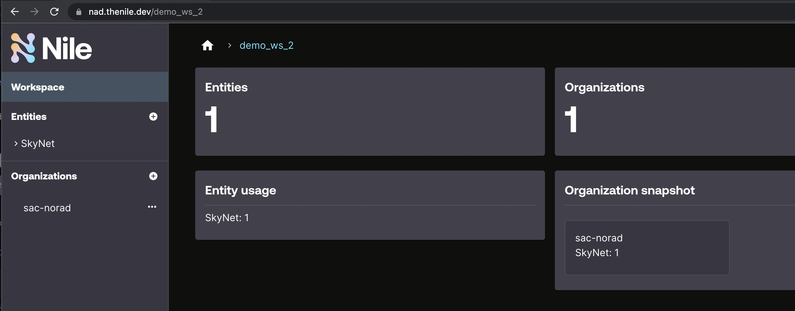

# Quickstart


## Contents

* [Overview](#overview)
* [Prerequisites](#prerequisites)
* [Setup](#setup)
* [Run](#run)
* [Next steps](#next-steps)

## Overview

As described in the [top-level README](../README.md), the mock scenario in these examples is a company that provides SaaS.


The mock scenario in these examples is a company that provides a [Database as a Service](../usecases/DB/)
This quickstart programmatically setups up your [Nile](https://thenile.dev/) control plane similar to what is done in the Nile quickstart documentation.
By the end of this quick start, you will have:

- a workspace (your control plane)
- an entity definition with a schema (the definition of your data plane that represents a MySQL database)
- an organization (a tenant) with one user (end customer) in that organization
- an entity instance (logical instance of the MySQL database) in that organization

## Prerequisites

1. Your environment should have the following installed:

   - `node`
   - `ts-node`
   - `yarn` (or `npm`)

2. Run the following command from the `quickstart` directory:

   ```
   yarn install
   ```

   Your output should resemble:

   ```bash
   yarn install v1.22.19
   warning package.json: No license field
   warning No license field
   [1/4] 🔍  Resolving packages...
   [2/4] 🚚  Fetching packages...
   [3/4] 🔗  Linking dependencies...
   [4/4] 🔨  Building fresh packages...
   ✨  Done in 2.26s.
   ```

## Setup

1. Navigate your web browser of choice to the [Nile Admin Dashboard](https://nad.thenile.dev/).
You have two options for logging in:

   - SSO: click `Continue with Google`.
   - Username/password: if you haven't signed up to Nile yet, go to [our website](https://thenile.dev), enter your email address, and click `Talk to us`. Someone from Nile will contact you.

2. Your SaaS application lives in a workspace, which represents your control plane. You probably already have a name for the SaaS application you'd like to build, so now you can create it. From the dashboard, click `Create a workspace`.  In the textbox, enter the name of a new workspace. 

## Run

There are three ways to execute the quickstart:

1. Step-by-step from the Nile Admin Dashboard: follow the quickstart instructions on the Nile docs webpage for the UI quickstart, useful for people who like to use UIs
2. Step-by-step from the command line: execute snippets of Typescript code using the JS SDK (see [step-by-step](#step-by-step-from-the-command-line) instructions), useful to learn from individual code blocks
3. Programmatically from the command line: all steps executed with a single command (see [one-command](#one-command) instructions), quickest of the three options

If you are following option 2 or 3 (running from the command line), you need a local file with your Nile configuration.
For that purpose, at the top-level of the examples, copy the `.env.defaults` file to `.env` and then edit the new `.env` file to match your existing workspace.

```bash
# From the top level of the examples folder
$ cp .env.defaults .env
```

Now that you have a local configuration file for Nile, you are set to go!

### Step-by-step from the command line

1. Create a workspace (refer to code [src/ws.ts](src/ws.ts)).

```
yarn setup-ws
```

2. Create an entity (refer to code [src/entity.ts](src/entity.ts)).

```
yarn setup-entity
```

3. Create a user (refer to code [src/user.ts](src/user.ts)).

```
yarn setup-user
```

4. Create an organization (refer to code [src/org.ts](src/org.ts)).

```
yarn setup-org
```

5. Create an entity instance (refer to code [src/entity-instance.ts](src/entity-instance.ts)).

```
yarn setup-entity-instance
```

### One-command

To execute the entire workflow, run the following command:

```
yarn start
```

## Validate

Log into the [Nile Admin Dashboard](https://nad.thenile.dev/) to see the control plane and entity instances.
For the email and password, use the `NILE_DEVELOPER_EMAIL` and `NILE_DEVELOPER_PASSWORD` values you specified in the `.env` file.

Your dashboard should resemble below:



Nile automatically generates the OpenAPI spec for the new entity, see the `OPENAPI` tab in the dashboard.

## Next Steps

Run the [webapp](../webapp), a self-service frontend that integrates with Nile on the backend
