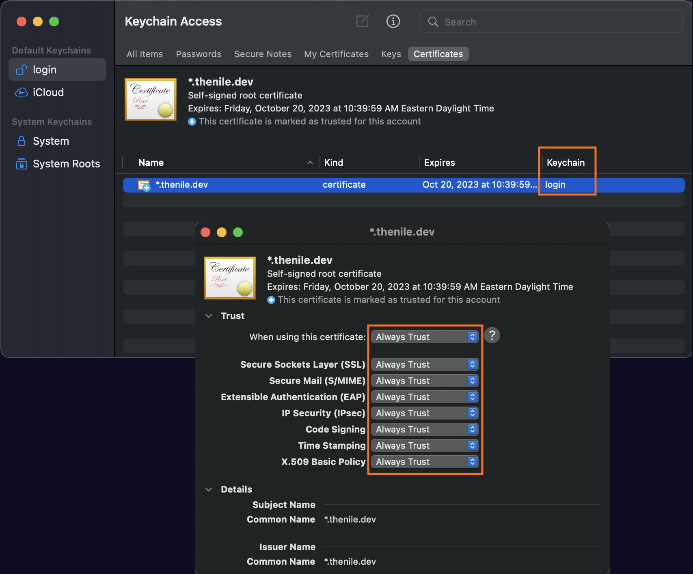

# Self-serve Webapp


## Overview

This example shows a SaaS service integrated with [Nile](https://thenile.dev/). 
Nile provides an entity system, event system, and tenant-aware metrics.

The mock scenario in these examples is a company that provides SaaS.


Want to view a hosted version of this example SaaS app that is built on Nile?  Checkout https://demo-db-saas.thenile.dev (login as one of the predefined [users](../usecases/DB/init/users.json)), then walk through the [playbook](#playbook).

Want to run this example yourself?  Keep reading.
This webapp demonstrates a sample frontend for their SaaS application that integrates with the control plane using Nile React components for [Next.js](https://nextjs.org/).
It provides self-service workflows for user signup/login, org creation, and instance management, with metrics API for serving up metrics about the user instances, and can be run with a reconciler to synchronize the control plane and data plane.


## Contents

* [Overview](#overview)
* [Prerequisites](#prerequisites)
* [Setup](#setup)
* [Run the web server locally](#run-the-web-server-locally)
* [Playbook](#playbook)
* [Advanced](#advanced)

## Prerequisites

1. Your environment should have the following installed:

   - `node`
   - `ts-node`
   - `yarn` (or `npm`)

2. Run the following command from the `webapp` directory:

   ```
   yarn install
   ```

### Setup certificates

Currently, Nile will only serve cookies to `\*.thenile.dev` domains, which is required for login, so you must put this webapp in that domain. Create certificates for your local machine and add them to your keychain.

1. Edit the file `/etc/hosts` and at the bottom, add the line `127.0.0.1 local.thenile.dev`

2. From the `webapp` directory, create a new directory for certificates.

   ```bash
   mkdir .certificates
   ```

3. Run the following command to add an SSL key that lasts 1 year

   ```bash
   (cd .certificates && \
      openssl req -x509 -out localhost.crt -keyout localhost.key \
        -days 365 \
        -newkey rsa:2048 -nodes -sha256 \
        -subj '/CN=*.thenile.dev' -extensions EXT -config <( \
        printf "[dn]\nCN=*.thenile.dev\n[req]\ndistinguished_name = dn\n[EXT]\nsubjectAltName=DNS:*.thenile.dev\nkeyUsage=digitalSignature\nextendedKeyUsage=serverAuth"))
   ```

3. Trust the new certificate you just created

   - Run `open .certificates/localhost.crt` to open it in Keychain.
   - Make sure the certificate is under `Login` (not `System`), moving it there if necessary.
   - Double click on the certificate, and from the popup window, expand the `Trust` dropdown and select `Always Trust`.

   

## Setup

You must do all the steps in the [Setup section](../README.md#setup) of the top-level README.md.

:stop_sign: **STOP** :stop_sign: Do not proceed until you have done the above setup :heavy_exclamation_mark:

Then, run the following command to preconfigure the Nile control plane with an entity, organizations, users, and entity instances for the mock usecase, so that you're not starting from scratch.

   ```bash
   yarn setup-nile
   ```

(Optional) If you want to hook up your Nile control plane to a data plane, run the reconciler to synchronize events between the control plane and data plane (e.g. if you use the webapp to create new entity instances). If you skip this step, the instances in your webapp will not go to `status=Up`.  Follow the instructions in one of the following examples, running them in a separate terminal window:

  - [Data Plane with Pulumi via JS](data-plane/pulumi/) | JS SDK | Synchronize your data plane and control plane
  - [Data Plane with Apache Flink and Kubernetes via JS](data-plane/k8s/) | JS SDK | Synchronize a control plane built with Nile with data plane that uses Apache Flink and Kubernetes
  - [Data Plane with Apache Flink and Kubernetes via Python](data-plane-python/k8s/) | Python SDK | Synchronize a control plane built with Nile with data plane that uses Apache Flink and Kubernetes
  - [Fake Data Plane via JS](data-plane/fake/) | JS SDK | Synchronize your fake data plane and control plane (if you don't have a real data plane to test)
  
## Run the webapp

Run the following command from the `webapp` directory.  It does two things concurrently: starts the web server locally and produces mock metrics that are rendered in charts in the webapp.

```bash
yarn dev
```

## Playbook

### As an end-user

1. If you started the webapp locally, open your browser to [https://local.thenile.dev](http://local.thenile.dev).  If you want to view the hosted version, open your browser to https://demo-db-saas.thenile.dev.

2. Log in as one of the predefined end users for the entity type from the [usecases](../usecases/). For example, for entity type `DB`, login as one of these [admins](../usecases/DB/init/admins.json) or [users](../usecases/DB/init/users.json), such as `polina@demo.io` (password is `password`).

   The user login screen should resemble below:

   

   :information_source: View the page's [source code](components/MyLoginForm/index.tsx), which showcases one of Nile's React components `LoginForm`.

3. Once logged in, the user sees the entity instances (e.g. databases in this mock scenario) that she has access to.

   

   :information_source: View the page's [source code](components/db/GridView/index.tsx), which showcases one of Nile's React components `Queries` in order to easily list the instances.

4. Click on one of the instances to see metrics, which can be used for [consumption-based billing](https://www.thenile.dev/blog/launch-infra-saas#metrics-and-consumption-based-billing).

   

   :information_source: View the page's [source code](components/InstanceMetrics/RequestsLineChart/index.tsx), which showcases one of Nile's React components `MetricsLineChart`.

5. Logout. Then instead of logging in as an existing user, sign up as a new user.  Enter any email/password, then create an organization name.

   :information_source: View the page's [source code](components/MySignupForm/index.tsx), which showcases one of Nile's React components `SignUpForm`.

6. Notice that this new user sees none of the instances from the other user's organization.  [Multi-tenancy](https://www.thenile.dev/blog/launch-infra-saas#multi-tenant-control-plane) is built into Nile, and tenants cannot see instances from other tenants.

7. Create a new instance and specify input parameters for the new resource.

   :information_source: View the page's [source code](components/EntityTable/CreateInstance.tsx), which showcases one of Nile's React components `EntityForm`.

8. Click on `Add a new user to this org`, and add a new made-up user and password. Log out of the webapp and log in as the newly created user. Observe that the new user sees all the same instances in the org.

### As a Nile developer

If you started this webapp locally, then you can log into Nile Admin Dashboard to see the metadata from the webapp.

1. Login to the [Nile Admin Dashboard](https://nad.thenile.dev/) to see the control plane and entity instances.

2. From the dashboard, notice the multi-tenancy features, with tenants belonging to different organizations. Your dashboard should resemble below:

   

3. Depending on your SaaS, you could have a [consumption-based billing](https://www.thenile.dev/blog/launch-infra-saas#metrics-and-consumption-based-billing) model that's tied into the resources, and the end user can see their consumption from the UI.  For this demo, the metrics are mocked up by a generator since there is no real resource utilization to report.

   :information_source: These mock metrics are generated by [this source code](../metrics/src/generate_metrics.ts), which showcases the [nile-js](https://github.com/TheNileDev/nile-js) SDK.

4. If you are running the reconciler in a separate terminal window (see [Setup](#setup)), then observe the [event handler](https://www.thenile.dev/blog/launch-infra-saas#event-handling-and-synchronization-with-the-data-plane) in action as it processes the events, provisions resources, and updates Nile with its status when it goes to `Up`. 

   :information_source: View the event handler's [source code](../data-plane/fake/src/commands/reconcile/index.ts), which showcases Nile's event handler API.

## Advanced

### Change Entity Type

The default scenario in these examples is a company that provides a database as SaaS.
But you can modify the `NILE_ENTITY_NAME` parameter in your `.env` file (see [Setup](#setup)) to change it to be any other type of service offering, one of:

- [Database as a Service](../usecases/DB/) (same as in the Nile Quickstart): `NILE_ENTITY_NAME=DB`
- [SkyNet as a Service](../usecases/SkyNet/): `NILE_ENTITY_NAME=SkyNet`
- [Banking as a Service](../usecases/Banking/): `NILE_ENTITY_NAME=Banking`
- [Workload as a Service](../usecases/Workload/): `NILE_ENTITY_NAME=Workload`
- [YOLO](../usecases/README.md#yolo)
